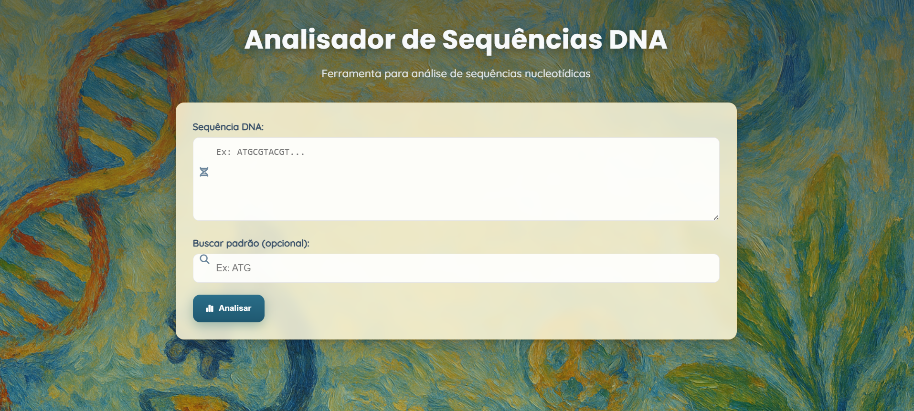

# 🧬 Analisador de Sequências de DNA  

Este projeto é uma aplicação web interativa que permite **analisar sequências de DNA** de forma simples, educativa e visual.  
Além das funcionalidades científicas, o site foi desenvolvido com uma **estética artística inspirada no impressionismo**, unindo ciência e arte em uma experiência única.  

---

## 🚀 Funcionalidades

- Inserção de sequências de DNA manualmente no formulário.  
- Validação da sequência (aceita apenas A, T, C e G).  
- Cálculo de:
  - Frequência de cada nucleotídeo (A, T, C, G).  
  - Conteúdo GC (%) da sequência.  
  - Ocorrência de um **padrão específico** informado pelo usuário.  
- Visualizações:
  - Sequência colorida por nucleotídeo.  
  - Gráfico de barras mostrando a distribuição de nucleotídeos.  
- Interface moderna com design artístico inspirado em **pinturas impressionistas**.  

---

## 🎨 Destaques de Design

- **Fundo artístico impressionista**.  
- **Overlay translúcido** para melhor leitura do conteúdo.  
- **Container semi-amarelado** lembrando páginas antigas de laboratório.  
- Tipografia moderna (*Poppins* + *Quicksand*).  
- Ícones intuitivos (DNA, busca, gráficos).  
- Botões com **gradiente e microinterações** (hover, foco).  

---

## 🛠️ Tecnologias Utilizadas

- **HTML5** → estrutura semântica.  
- **CSS3** → estilização com variáveis, gradientes, sombras e responsividade.  
- **JavaScript (ES6+)** → lógica de análise e renderização dinâmica.  
- **Chart.js** → gráficos interativos (distribuição de nucleotídeos).  
- **Google Fonts** (*Poppins*, *Quicksand*).  
- **Font Awesome** → ícones ilustrativos.  

---

## 📂 Estrutura do Projeto
├── index.html # Página principal

├── styles.css # Estilização do site

├── script.js # Lógica de análise em JS

├── dna-structure.jpg # Imagem de fundo artístico

└── README.md # Documentação do projeto

---

## 💡 Possíveis Melhorias Futuras

- Tradução DNA → RNA → Proteína.  
- Identificação de ORFs e códons de start/stop.  
- Análises mais avançadas (k-mers, Tm, GC por janela).  
- Upload de arquivos FASTA.  
- Exportação de resultados (CSV/JSON).  
- Animações artísticas adicionais (brush strokes, DNA giratório).  

---

## 📸 Preview

---

## 👨‍💻 Autor

Mariana Gasparotto Palácios

Desenvolvido como projeto de estudo unindo **bioinformática** e **design artístico**.  

---

